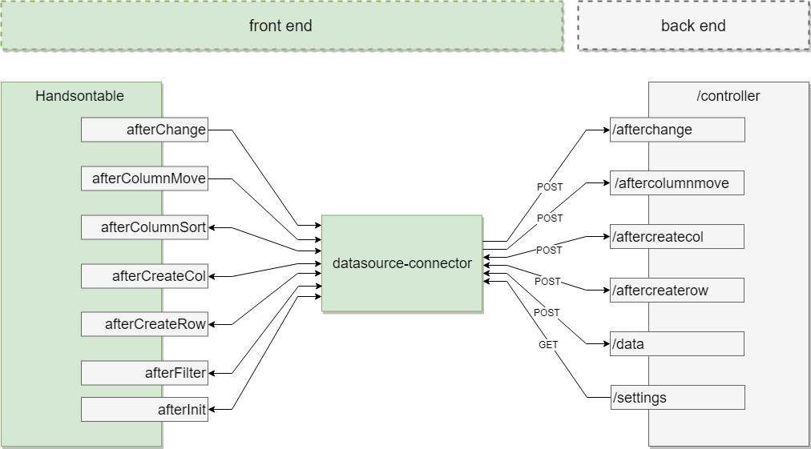

# datasource-connector
Handsontable plugin that connects with remote backend data source.

## Overview

This connector allows you connect to the backend.



Components diagram shows the connection between HTML frontend of your web app, where you have Handsontable and the REST backend. Datasouce-connector plugin is the communication link between Handsontable instance and the backend. On the backend side you may sore your data in the database you like.

Supported events:

- afterInit
- afterChange
- afterColumnMove
- afterColumnSort
- afterRemoveCol
- afterCreateCol
- afterCreateRow
- afterRemoveRow
- afterFilter
- afterSetCellMeta

Supported features:

| Supported feature | Description    |
|:-----------------:|:---------------|
| Filtering | Display rows that meet your criteria and hide the rest. |
| Moving | Drag rows or columns to swap them within the table |
| Sortting data | Sort data in ascending or descending order throughout the column. |
| Alignment |	Decide where the content is placed within the cell or a range of cells. |
| Comments	|Provide an additional note about the cell to help better understand its content. |
| Conditional formatting	| Define how specific cells are formatted depending on their values. |
| Merge cells	| Display cells across multiple rows or columns. |
| Moving |	Drag rows or columns to swap them within the table. |
| Read-only	| Lock the cell or a range of cells to disallow altering them. |
| Resizing	| Drag the sizing handle to change the size of column or row. |
| Sorting data |	Sort data in ascending or descending order throughout the column. | 


## Basic usage 

### Setup
Embed this code inside your HTML file: 
```html
<script src="handsontable.full.js"></script>
<script src="datasource-connector.js"></script>
<link rel="stylesheet" media="screen" href="handsontable.full.css">
```

### Spreadsheet container
Add an empty <div> element that will be turned into a spreadsheet. Let's give this element an "container" ID

```html
<div id="container"></div>
```

### Initialize
In the next step, pass a reference to that `<div class="container">` and setup yor backend controller url by passing into controllerUrl option.

```javascript
var container = document.getElementById('container');

var hot = new Handsontable(container, {
  rowHeaders: true,
  colHeaders: true,
  datasourceConnector: {
    controllerUrl: 'http://yourdomain.com/controller',
    requestHeaders: { 'Content-Type': 'application/json' }
  }
});
```

You may to register for event what is emit on each xhr communication. Please read this [instruction](doc/onDataSend.md) in that case.

The configured backend need to support methods described in  [Data specification](doc/README.md)


If you have `Express.js` you may use the `datasource-node` package to generate the backend controller or see the `node` example.