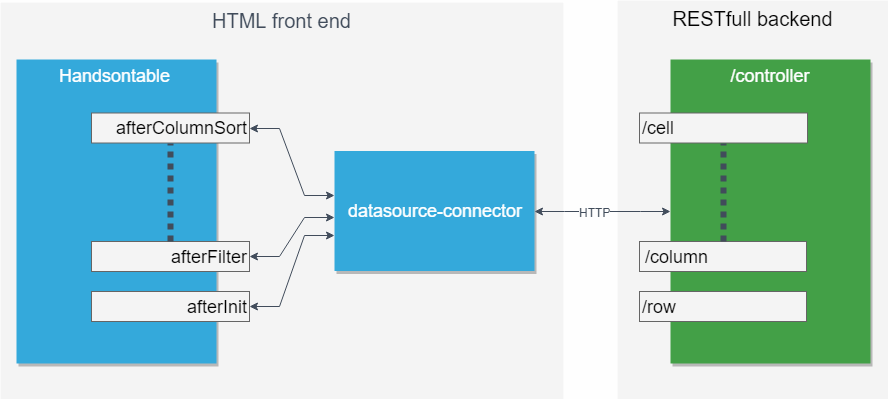

# datasource-connector
Handsontable plugin that connects with remote backend data source.

## Overview

This connector allows you connect to the backend.




## Basic usage 

### Setup
Embed this code inside your HTML file: 
```html
<script src="handsontable.full.js"></script>
<script src="datasourceConnectorPlugin.js"></script>
<link rel="stylesheet" media="screen" href="/dist/handsontable.full.css">
```

### Spreadsheet container
Add an empty <div> element that will be turned into a spreadsheet. Let's give this element an "container" ID

```html
<div id="container"></div>
```

### Initialize
In the next step, pass a reference to that `<div class="container">` and setup yor backend controller url by passing into baseURL option.

```javascript
var container = document.getElementById('container');

var hot = new Handsontable(container, {
rowHeaders: true,
colHeaders: true,
datasourceConnector: {
baseURL: 'http://yourdomain.com/controller'
}
});
```

The configured backend need to support methods described in  [Data specification](doc/README.md)

If you have `Express.js` you may use the `datasource-node` package to generate the backend controller or see the `node` example.